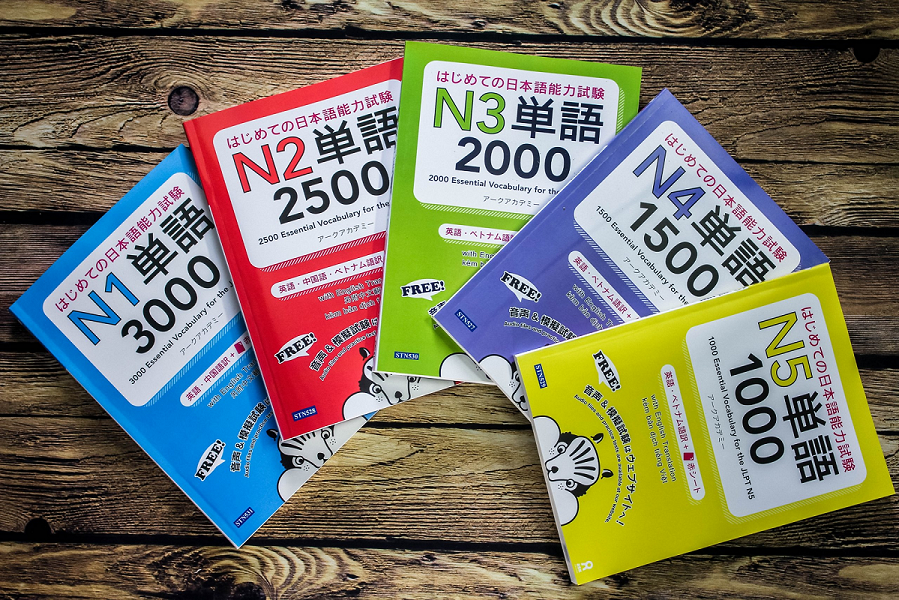
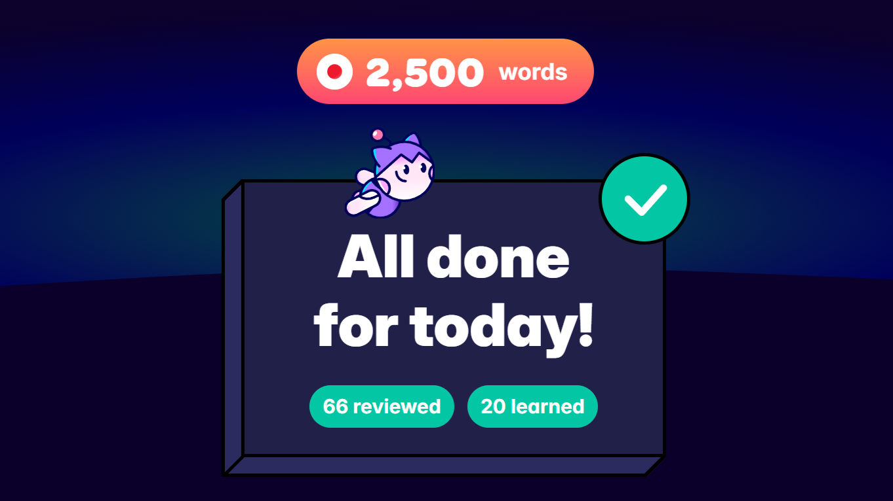

It all started during my second trip to Japan in the summer of 2023 when a gachapon machine with UNO tote bags at Akihabara Station malfunctioned. The capsule had gotten stuck while coming down, and there was no way to retrieve it. A young station worker quickly came over to help me. She pulled a key from her pocket, opened the machine, and unstuck the capsule. I opened the compartment, but my bag still wasn’t there. I must have looked very confused because she approached again and gestured for me to turn the handle. When I did, I finally heard the “gasha” of the mechanism and the “pon” of the capsule landing. Happy to have gotten a keepsake for my best friend, I turned to look at the girl. She was bowing, and I, deeply grateful, made my best attempt at a bow. We both smiled, and I went on my way to explore figure shops with my dad. We didn’t exchange a single word.

It would be a lovely story to say that this girl and my interaction with her were the reasons I started learning Japanese, but that’s not the case. The real reason is that, to me, that girl was Japan. During the two weeks I was there, not a single day went by without a similar experience. Whether it was at the hotel where we stayed or a curry restaurant in a train station's underground, it became clear to me that serving society is one of the most important values in Japanese culture. Of course, not everyone is as helpful as that girl, and every country has both good and bad people, but if you open yourself to it, you’ll notice how much effort people put into their work to make life better for others.

At the time, I was 19 and midway through my video game development degree. I was going through a difficult period, questioning whether my career could truly do any good for society. I had chosen it after finishing _Persona 5_ during the pandemic and realizing the immense potential video games have to transform us into better versions of ourselves. They let us step into a character’s shoes and offer new perspectives on life. In some cases they help us close chapters of our lives that no longer serve us and open doors to new ones filled with hope. However, looking at the projects being developed in my country, I only saw people trying to squeeze every last penny out of their players.

Seeing how hard Japanese people worked to provide the best service rekindled a part of me that had felt lost. I realized that while Japan had something I was seeking, I also had something they yearned for. As with all good things in this world, there are sacrifices. As I spent more time among the people, I realized this great emphasis on being helpful was affecting their ability to express themselves honestly. While I was wondering how to be good for others, they were wondering how to be good for themselves.

As a Mexican living in Mexico, I don’t fear expressing my true self, no matter how small the gesture. If I’m happy, I dance. If I’m sad, I cry. If someone does something I disagree with, I say so. If I see my mom, I hug her. There are very few barriers preventing me from showing the world I am a real person with real feelings. The Japanese, on the other hand, not only face their personal barriers but also those imposed by their culture. Realizing this, I understood we had much to learn from each other. However, there was a significant wall between us. Even without saying a single word, I was able to communicate many feelings to that girl in Akihabara, but it was clear that achieving a deeper mutual understanding would require speaking the same language. That’s why, upon returning to my home in Guadalajara, Jalisco, I began my journey toward Japanese fluency.

I began with a structured guide, focusing on pronunciation and kana. I can’t overstate how critical it is for beginners to master pronunciation and pitch accent early ([Dogen’s phonetics series is excellent](https://www.youtube.com/watch?v=O6AoilGEers&list=PLxMXdmBM9wPvsySiMoBzgh8d68xqKz1YP)). However, my struggles began with SRS. I initially tried learning kanji and vocabulary simultaneously, but it was overwhelming, so I dropped vocabulary at first. I shifted to just kanji using the Remembering the Kanji (RTK) method, tackling 2,200 kanji in four months by studying 20 per day in order to get back to vocab as quickly as possible. While I finished the deck, the lack of context made it a draining experience, and I developed a strong resentment toward Anki.

After RTK, I moved to the Core 2k/6k deck for vocabulary. While kanji familiarity made words easier to learn, RTK reviews consumed too much time, leaving me just as frustrated. Eventually, I switched to Tango N5-N1 decks, which helped me prepare for the JLPT, and therefore, motivated me, but after almost a year and a half of painstaking study, I quit Anki altogether last November. By then, my approach had lost its connection to my original motivation for learning Japanese.

Throughout this process, I had been trying to balance my studies, personal projects, and Japanese learning, leaving little time or energy to engage with content outside of decks. Additionally, I must clarify something important: I’m not a big fan of anime, manga, or Japanese dramas. I find them entertaining, but I don’t feel a deept enough emotional connection to them as to fuel a journey this long and hard. I tried [Satori Reader](https://www.satorireader.com/), but even though it was easy, I couldn’t connect with the stories. I had also tried watching YouTube videos in Japanese, but the autogenerated subtitles were terrible. This meant that apart from studying decks, I wasn’t consuming any content in the language. In total, including other decks I haven’t mentioned, I studied for 273 hours before quitting Anki. In hindsight, it’s incredible how I lasted so long without being in contact with the language outside of the program.

A month had passed since I decided to quit Anki, and it seemed like the end of my Japanese studies, when I received an email from [Migaku](https://migaku.com/). Among other things, it mentioned a feature that caught my attention: AI-generated subtitles for YouTube. The month-long break from Anki made me realize this was exactly what I needed—an approach that allowed me to connect with the people of Japan. While it’s true that most popular Japanese content creators have high production levels, many lesser-known channels make very personal videos that let you connect with them on a deeper level. Having mostly accurate subtitles integrated with [Migaku](https://migaku.com/)’s system, which not only shows dictionary definitions but also explains words in context, breaks down sentences, and provides full sentence translations, completely changed my relationship with Japanese. I maintained my decision to quit Anki altogether, but, thankfully, I could import the words I had learned with the Tango decks, so it's clear to me that all those hours weren’t wasted.

Now, all the cards I study are mined with [Migaku](https://migaku.com/) in just one click. While mining makes it easier to remember words, I believe there’s something that’s not discussed enough: mining sentences keeps you close to the real reason you’re learning Japanese. Whether it’s to watch anime without subtitles, read manga in its original language, or, like me, connect with Japanese people, it’s vital to stay in touch with your motivation. Even with mined sentences, studying has its challenges, but it’s nothing compared to the dreadful feeling of studying for hundreds of hours without remembering why you do it. Pre-made decks still have a place in language learning but should simply serve as a gentle bridge to mining. If you find yourself genuinely hating your experience learning a language you trully care about, ensure most of your time is spent doing something that brings you back to what resonated enough with you to start this journey. Because, in the end, learning a language isn’t just about memorizing words and grammar rules, it’s about opening doors to new worlds and hearts yet to be taken.

Joining the [Migaku](https://migaku.com/) Discord community helped me realize there are thousands of people in the same boat as me. Although we don’t all share the same story, I know there are many ways I can help others have a better experience and, for some, turn it from an awful grind into a fun, fulfulling activity. I already have some projects in mind that I’ll be sharing in the future, but for now, if you’re transitioning from a JLPT pre-made deck to [Migaku](https://migaku.com/), I’ve made this frequency list for the new extension to help you find vocabulary for each level of the exam. Enjoy!



I hope the things I share will be helpful to you. Thank you so much for reading my story, it means a lot to me!